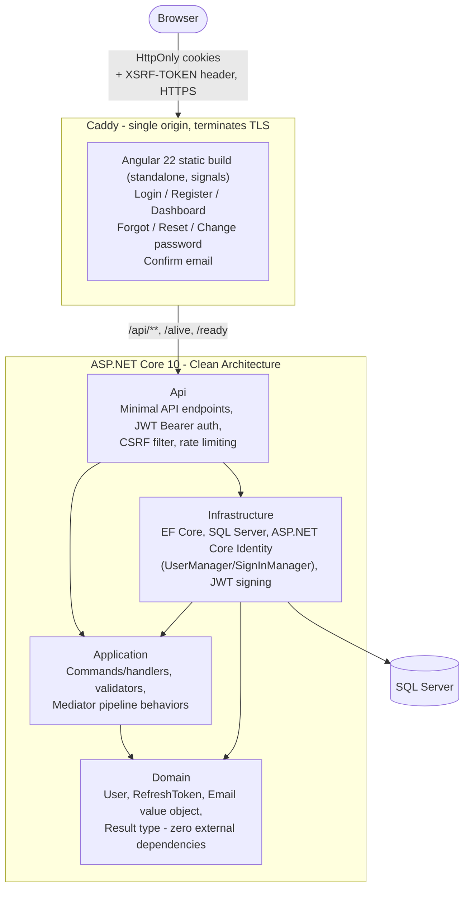

# Secure Authentication

A production-shaped authentication service, built as the base template for future portfolio projects. Backend is .NET 10 in a Clean Architecture layout; frontend is Angular 22 (standalone components, signals). Authentication uses HttpOnly cookies end to end — no token ever touches JavaScript.

## Why this exists

Most "auth demo" repos either fake the hard parts (plaintext passwords, no refresh flow, tokens in `localStorage`) or bury the real decisions in framework magic. This one is meant to hold up under a "why did you do it that way" conversation: every non-obvious choice below has a reason, and most of them were only found by actually breaking the thing during development (see [`docs/PORTFOLIO_WRITEUP.md`](docs/PORTFOLIO_WRITEUP.md) for the long-form version).

## Architecture



Dependencies point inward: `Domain` has no project references at all; `Application` depends only on `Domain`; `Infrastructure` implements the interfaces `Application` defines. Swapping SQL Server for Postgres, or the JWT scheme for opaque sessions, only touches `Infrastructure`.

User credential storage is backed by ASP.NET Core Identity (`UserManager`/`SignInManager`), but `Domain.Users.User` stays a plain, framework-free POCO — it never inherits `IdentityUser` and carries no password hash at all. `Infrastructure`'s `UserRepository` is the only place that knows Identity exists: it wraps `UserManager`/`SignInManager` calls and reconstructs a `Domain.User` in memory from whatever Identity returns. `Application`'s `IUserRepository` port never changed shape in a way that leaked Identity types upward — swap the adapter, the rest of the app doesn't notice.

## Security features

- **HttpOnly, Secure, SameSite=Strict cookies** for both the JWT access token and the opaque refresh token — never readable by JavaScript, so a successful XSS can't exfiltrate a session.
- **Refresh token rotation with reuse detection**: every `/refresh` call issues a new token and revokes the old one. If a revoked token is ever presented again, every active token for that user is revoked immediately, forcing full re-login. The same all-sessions revocation runs after a successful password reset or change — a compromised session can't outlive the credential that (maybe) leaked it.
- **No account enumeration**: login returns the same generic "invalid credentials" error whether the email doesn't exist, the password is wrong, or the account is locked out — distinguishing them would let an attacker probe which emails are registered.
- **Forgot/reset/change password**, backed by Identity's own token primitives (`GeneratePasswordResetTokenAsync`/`ResetPasswordAsync`/`ChangePasswordAsync`). `/forgot-password` always responds identically whether or not the email is registered, so it can't be used to enumerate accounts. Email delivery is real (SMTP via MailKit) whenever `Smtp:Host` is configured, and falls back to a logging stub (`LoggingEmailSender`) otherwise — local dev and CI need no email credentials at all to work.
- **Email confirmation as a hard login gate**, not just a tracked flag (`RequireConfirmedEmail`). An otherwise-correct login for an unconfirmed account fails with a distinct, deliberately non-generic error — the one intentional exception to the "always generic" rule above, because a user with the right password deserves to know why login is failing. `/resend-confirmation` exists for expired/lost links, with the same non-enumerating response shape as `/forgot-password`.
- **CSRF double-submit cookie**, independent of and in addition to `SameSite=Strict` — defense in depth for the browsers/proxies that don't fully honor `SameSite`.
- **Credential storage via ASP.NET Core Identity** (`UserManager`/`SignInManager`) — PBKDF2 password hashing, uniqueness enforcement, and **account lockout after 5 failed attempts** (15 minutes), all handled by Identity rather than hand-rolled.
- **Rate limiting** on every state-changing auth endpoint, keyed by client IP — brute-force defense in depth alongside Identity's own per-account lockout. **Redis-backed once `ConnectionStrings:Redis` is configured** (as it is by default in `docker-compose.yml`), so the limit is a real shared count across API instances instead of a per-process one that a load balancer would silently multiply — falls back to an in-memory limiter with identical semantics when Redis isn't configured (local `dotnet run`, CI).
- **Two-factor authentication (TOTP)**, built on ASP.NET Core Identity's own authenticator token provider — an enabled account can't complete login on password alone. A short-lived `mfa_challenge` cookie (HttpOnly, `IDataProtector`-protected, 5 minutes) bridges the gap between password verification and code verification without ever putting anything the client could forge into a header or body. Recovery codes (10, single-use) cover the "lost the device" case; one field on the login-completion form accepts either a TOTP code or a recovery code, tried in that order.
- **Self-service account deletion and data export**, both requiring the current password. Deletion cascades every refresh token at the database level (`RefreshTokenConfiguration`'s `OnDelete(DeleteBehavior.Cascade)`), so there's no separate "revoke sessions" step to forget.
- **No CORS**: frontend and backend are served from one origin, always — a Caddy reverse proxy terminates TLS and routes `/api/**` (and `/alive`/`/ready`) to the API while serving the Angular build directly for everything else, in Docker Compose exactly as in `ng serve`'s local dev proxy. No `Access-Control-Allow-*` surface ever exists to misconfigure. `Api` trusts `X-Forwarded-Proto` from Caddy (`UseForwardedHeaders`) rather than guessing the scheme, and doesn't publish its own port — Caddy is the only way in, so that trust can't be spoofed from outside.
- **JWT signing algorithm pinned explicitly** (`ValidAlgorithms = [HmacSha256]`) rather than trusted from the token's own header, and a maximum password length so PBKDF2 hashing can't be turned into a cheap CPU-exhaustion vector.
- **JWT signing key rotation, without an all-users-logged-out cutover.** `Jwt:SigningKeys` is an ordered list, not a single value — the first entry signs new tokens (carrying its id as the token's `kid` header), but every configured entry stays valid for *verifying* tokens already issued with it. Refresh tokens are unaffected (they're opaque, hashed, DB-backed values, not JWTs at all) — see "Rotating the JWT signing key" below.
- **No secrets committed, dev included**: `appsettings.Development.json` ships with empty connection string and signing key; local `dotnet run` supplies them via [.NET user-secrets](https://learn.microsoft.com/aspnet/core/security/app-secrets), Docker Compose via a gitignored `.env`.
- **Structured error responses everywhere**: unhandled exceptions return RFC 7807 `ProblemDetails` (stack traces only ever included in Development, never in Production) instead of a bare 500. Baseline security response headers (`X-Content-Type-Options`, `Referrer-Policy`, a strict `Content-Security-Policy`, HSTS) are set on every response.
- **Concurrent-refresh coalescing on the frontend**: refresh tokens rotate on every use, so two requests racing a single 401 at the same moment could otherwise each call `/refresh` independently — the loser presents an already-rotated token, which looks identical to a stolen-token replay and revokes the whole session. The Angular `AuthService` shares one in-flight refresh `Observable` across concurrent callers to close that race.

### Rotating the JWT signing key

1. Generate a new key and id: `openssl rand -base64 32`, plus any short label (e.g. `2027-01`).
2. In `.env`, move the *current* `JWT_SIGNING_KEY`/`JWT_SIGNING_KEY_ID` values to `JWT_SIGNING_KEY_PREVIOUS`/`JWT_SIGNING_KEY_ID_PREVIOUS`, and set `JWT_SIGNING_KEY`/`JWT_SIGNING_KEY_ID` to the new pair. Uncomment the `Jwt__SigningKeys__1__*` lines in `docker-compose.yml`.
3. Deploy (`docker compose up --build`). New tokens sign with the new key; tokens already issued with the old one keep validating until they naturally expire (`Jwt:AccessTokenLifetimeMinutes`, 15 by default) — no session is force-terminated by the rotation itself.
4. Once at least one access-token lifetime has passed, remove the `*_PREVIOUS` values from `.env` and re-comment the `Jwt__SigningKeys__1__*` lines, then deploy again to actually drop trust in the old key.

### Secrets in production

This project's own `docker-compose.yml` passes secrets as plain environment variables (`DB_PASSWORD`, `REDIS_PASSWORD`, `JWT_SIGNING_KEY`, `SMTP_PASSWORD`), sourced from a gitignored `.env` — a reasonable default for a single-host demo/base-template deployment, but one where a value is visible to anything that can run `docker inspect` on the container or read its process environment.

For a deployment where that matters, the API also reads configuration from **`/run/secrets`**, one file per value, wired via [`AddKeyPerFile`](https://learn.microsoft.com/dotnet/core/extensions/configuration-providers#key-per-file-configuration-provider) (`Program.cs`). File names use the same `__` section-separator convention as the environment variables above — a file literally named `Jwt__SigningKeys__0__Key` containing just the key material maps to the same `Jwt:SigningKeys:0:Key` configuration value, and takes precedence over the environment variable of the same name. This is the standard mount shape for:

- **Docker Swarm secrets** — `docker secret create`, then mounted automatically at `/run/secrets/<name>`.
- **Kubernetes `Secret`s** — mount as a volume at `/run/secrets` with `secretKeyRef`-style file names, rather than injecting them as env vars on the pod spec.
- **A cloud secrets manager** (Azure Key Vault, AWS Secrets Manager, ...) — most have a sidecar/CSI-driver integration that syncs secrets to files on disk in exactly this shape, which is the vendor-neutral reason this project reaches for `AddKeyPerFile` here instead of adding a specific vendor SDK as a dependency.

Nothing about this changes local dev or `docker compose up` — `/run/secrets` doesn't exist in either, so `AddKeyPerFile(optional: true)` is a no-op and the environment variables keep working exactly as before.

## Operational readiness

- **`GET /alive` and `GET /ready`**, split rather than one combined endpoint — a liveness check and a readiness check answer different questions and should have different consequences for a caller. `/alive` runs zero dependency checks and only confirms the process is responding at all; a database blip shouldn't make an orchestrator kill and restart an otherwise-healthy instance over it. `/ready` runs real DB connectivity (`AddDbContextCheck`, tagged `"ready"`) and answers "can this instance actually serve a request right now" — what should gate traffic. Both anonymous, unauthenticated, exempt from rate limiting since orchestrators poll them frequently. `/ready` is wired into `docker-compose.yml`'s own healthcheck for the API container, not just SQL Server's.
- **Refresh tokens are purged, not left to accumulate forever.** Rotation and logout only ever mark a token revoked; a background service (`RefreshTokenCleanupBackgroundService`) deletes rows once they're past their own expiry — revoked tokens are kept until then for forensic value (e.g. reviewing a reuse-detection incident after the fact), not deleted the moment they're revoked.
- **Structured logging via Serilog**, not the default provider. JSON to stdout in Production (what a container's log driver/aggregator actually wants), a readable console template in Development. Every HTTP request logs one structured line (method, path, status, elapsed ms) via `UseSerilogRequestLogging` — health-check polling is dropped to `Verbose` so it doesn't drown out real traffic. A startup failure is logged and flushed (`Log.Fatal` + `Log.CloseAndFlush`) instead of silently vanishing before any sink exists to catch it.
- **Security-relevant events are actually logged**, not just handled: failed logins (wrong password and unknown email alike — an operator watching for credential-stuffing sweeps needs both), account lockouts, refresh-token reuse (the actual signature of a stolen token), rate-limit rejections, password changes/resets, and email confirmation outcomes. Source-generated (`[LoggerMessage]`) for performance, never a password or raw token among the logged fields.
- **CI** (`.github/workflows/ci.yml`) builds and tests both the backend (including the Testcontainers-backed integration suite) and the frontend on every push/PR, then a third job actually runs `docker compose up --build` and drives a real register → confirm-email → login → `/me` flow through the deployed stack (Caddy, real TLS, real SQL Server) — the same class of wiring gap that static review and mocked tests can't catch (see `docs/PORTFOLIO_WRITEUP.md` section 5f).
- **Dependabot** (`.github/dependabot.yml`) keeps NuGet, npm, and the GitHub Actions themselves on a weekly update check — a base template that sits unmaintained accumulates exactly the kind of known-vulnerable transitive dependency section 5b's `dotnet list package --vulnerable` sweep already found once.
- **Containers restart on failure** (`restart: unless-stopped` on every `docker-compose.yml` service) — a crashed process or a host reboot doesn't require someone to notice and run `docker compose up` by hand.
- **Database backup and restore scripts** (`scripts/backup-db.sh`/`scripts/restore-db.sh`), using SQL Server's own `BACKUP DATABASE`/`RESTORE DATABASE` rather than a hand-rolled export. `backup-db.sh` writes a timestamped, compressed `.bak` file to `./backups` on the host (bind-mounted into the `sqlserver` container, separate from its own data volume, so a backup survives even if the volume doesn't). `restore-db.sh <file>` stops `api` first (so nothing holds a connection open mid-restore), forces the database into single-user mode, restores, and restarts `api` — both verified end-to-end against a real running stack: register a user, back up, register a second user, restore, confirm the second user is gone and the first survived.
- **Metrics and tracing via OpenTelemetry**, the same instrumentation vocabulary regardless of which backend eventually consumes it. `GET /metrics` (unauthenticated, un-rate-limited, same trust model as `/alive`/`/ready` in every way except one — no published container port, no Caddy route, so only reachable from inside the Compose network) exposes ASP.NET Core request/duration histograms, .NET runtime (GC, thread pool) gauges, and DNS lookup timings in Prometheus text format, ready to scrape with zero extra infrastructure. Distributed traces (one span per request, with real child spans for the EF Core database calls it made — verified end-to-end against a temporary OpenTelemetry Collector, not just compiled) only export once `Otel:OtlpEndpoint` points at an OTLP-compatible collector (Jaeger, Grafana Tempo/Alloy, Honeycomb, Datadog, ...) — same optional-infrastructure pattern as Redis/SMTP above, since a span with nowhere to go isn't useful the way a pull-based metric already is. The Prometheus exporter and EF Core instrumentation packages are still pre-1.0 upstream as of writing — a known, accepted tradeoff (they're the standard, actively-maintained packages for this stack, just not GA yet), not an oversight.

## Tech stack

| Layer | Choice |
|---|---|
| Backend | .NET 10, ASP.NET Core Minimal APIs |
| Mediator | [`Mediator`](https://github.com/martinothamar/Mediator) (source-generated, MIT) |
| Validation | FluentValidation |
| Persistence | EF Core 10 + SQL Server |
| Identity | ASP.NET Core Identity Core (`UserManager`/`SignInManager`), no cookie-auth scheme |
| Auth | JWT (access token) + opaque refresh token, both in HttpOnly cookies |
| Frontend | Angular 22, standalone components, signals, Reactive Forms, `aria-invalid`/`aria-describedby`/live-region error announcements |
| Testing | xUnit, NSubstitute, Testcontainers (backend); Vitest (frontend) |
| Logging | [Serilog](https://serilog.net/) (Apache-2.0) - structured JSON in Production, request logging, security-event logging |
| Infra | Docker Compose, Caddy (reverse proxy + static file serving + automatic HTTPS), Redis (distributed rate limiting) |
| 2FA | ASP.NET Core Identity's built-in TOTP provider, [`Otp.NET`](https://github.com/kspearrin/Otp.NET) (MIT) generating real codes in tests, [`qrcode`](https://github.com/soldair/node-qrcode) (MIT) rendering the setup QR client-side |
| Email | [MailKit](https://github.com/jstedfast/MailKit) (MIT) over SMTP - any provider, optional, falls back to a logging stub |
| Observability | [OpenTelemetry](https://opentelemetry.io/) (Apache-2.0) - metrics via a Prometheus scrape endpoint, traces via an opt-in OTLP exporter |

## Running it

### Docker Compose (full stack: proxy + frontend + backend + database + redis)

```bash
cp .env.example .env   # fill in DB_PASSWORD, REDIS_PASSWORD, and JWT_SIGNING_KEY
dotnet dev-certs https --export-path .certs/localhost.pem --format Pem --no-password   # once per session
docker compose up --build
```

Open `https://localhost` — Caddy terminates TLS with that same trusted dev cert, serves the Angular build directly, and reverse-proxies `/api/**`, `/alive`, and `/ready` to the API. EF Core migrations apply automatically on API startup. See [`.env.example`](.env.example) for how to generate the required secrets.

Password-reset and email-confirmation links are logged, not sent, until `SMTP_HOST` (and friends) are filled in in `.env` — entirely optional, everything else works without it. Note that login is blocked until an account confirms its email either way, so without SMTP configured, you'll need to grab the confirmation link from `docker compose logs api` (or use the `Frontend:BaseUrl`-built link's `email`/`token` query params directly against `/confirm-email`) to log in after registering.

This is the only path here that's actually deployment-shaped: single public entry point, real (locally-trusted) HTTPS end to end, `Secure` cookies genuinely working rather than silently dropped. To point this at a real domain instead of `localhost`, set `SITE_ADDRESS` and delete the `tls` line in [`proxy/Caddyfile`](proxy/Caddyfile) — Caddy then issues and renews a real Let's Encrypt certificate automatically.

The two options below trade that deployment-shaped correctness for hot-reload: no image rebuild per change, at the cost of running each piece directly instead of through Caddy.

### Frontend against it, locally

```bash
dotnet dev-certs https --trust   # once per machine
cd src/frontend
npm install
npm start   # exports that cert to .certs/, then ng serve --ssl uses it - see package.json
```

This proxies `/api/**` to the backend so the browser sees a single origin — required for the `Secure` cookie flags and the CSRF double-submit cookie to work correctly. `npm start` runs `export-dev-cert` first, which re-exports the trusted ASP.NET Core dev cert to `.certs/` (gitignored) every time, so `ng serve --ssl` presents the *same* already-trusted cert instead of Angular's own generic one — no separate browser warning to click through.

### Full local dev loop (backend + frontend run directly, not through `docker compose`)

`appsettings.Development.json` intentionally ships with an empty `ConnectionStrings:Database` and an empty `Jwt:SigningKeys[0].Key` — no real secret is ever committed, dev included. Supply them once via [.NET user-secrets](https://learn.microsoft.com/aspnet/core/security/app-secrets) (stored outside the repo, in your user profile):

```bash
cd src/backend/Api
dotnet user-secrets set "ConnectionStrings:Database" "Server=localhost,1433;Database=SecureAuthentication;User Id=sa;Password=<password>;TrustServerCertificate=True"
dotnet user-secrets set "Jwt:SigningKeys:0:Id" "primary"
dotnet user-secrets set "Jwt:SigningKeys:0:Key" "$(openssl rand -base64 32)"
```

```bash
# Terminal 1 - SQL Server
docker run -d -p 1433:1433 -e ACCEPT_EULA=Y -e MSSQL_SA_PASSWORD='<password>' mcr.microsoft.com/mssql/server:2022-latest

# Terminal 2 - backend
cd src/backend
dotnet run --project Api --launch-profile https

# Terminal 3 - frontend
cd src/frontend
npm start
```

## Tests

```bash
cd src/backend && dotnet test
cd src/frontend && npm test
```

**Backend — 119 tests**: unit tests for the Domain layer (value objects, entities), unit tests for Application command handlers (mocked dependencies via NSubstitute, including that a failed confirmation-email send doesn't fail registration), and integration tests that spin up real SQL Server and Redis containers via Testcontainers and exercise the full HTTP flow — register, login, `/me`, refresh rotation, reuse-detection, logout, CSRF enforcement, account lockout after repeated failed logins, forgot/reset/change password (including that a pre-reset/pre-change session stops working), email confirmation as a login gate plus resend, JWT validation against multiple configured signing keys (mid-rotation), refresh-token cleanup purging only tokens past their own expiry, account deletion/data export, two-factor setup/enable/disable/login/recovery-codes using real TOTP codes (via `Otp.NET`), and distributed rate limiting proven to actually live in Redis, not just enforced over HTTP — through `WebApplicationFactory`.

**Frontend — 46 tests**: `AuthService` (including a regression test proving concurrent `refreshOnce()` calls collapse into a single HTTP request, and the two-factor/account-deletion/data-export methods), the auth guard, the auth interceptor (credential attachment, exempt paths, silent-refresh-and-retry), and the password/email validators.

## Code style

```bash
cd src/backend && dotnet format --verify-no-changes   # drop the flag to fix in place
cd src/frontend && npm run format:check                 # `npm run format` fixes in place
```

Both run in CI on every push/PR — a formatting-only diff fails the build the same as a broken test.

## Project structure

```
src/
  backend/
    Domain/            entities, value objects, Result type - no dependencies
    Application/        commands, handlers, validators, abstractions (ports)
    Infrastructure/      EF Core, ASP.NET Core Identity, JWT, token hashing (adapters)
    Api/                minimal API endpoints, auth middleware, DI wiring
    tests/
      Domain.Tests/
      Application.Tests/
      Api.IntegrationTests/
  frontend/
    src/app/
      core/auth/        AuthService, interceptor, guard, validators
      features/         login, register, dashboard, forgot/reset/change-password, confirm-email
proxy/                  Caddyfile + Dockerfile - reverse proxy, static file serving, TLS
scripts/                backup-db.sh / restore-db.sh
docker-compose.yml
```

## Using this as a base for a new project

`Domain`/`Application` are meant to stay as-is across projects; `Infrastructure`/`Api` are where a new project's specifics live (see "Architecture" above). Before that, everywhere this repo's own name is baked in needs renaming — that's the entire project-specific surface, confirmed by grepping the whole tree for it:

1. **Solution file**: `git mv src/backend/SecureAuthentication.slnx src/backend/YourProject.slnx`.
2. **JWT issuer/audience**: `Jwt:Issuer`/`Jwt:Audience` in `src/backend/Api/appsettings.json`, `appsettings.Development.json`, and the `Jwt__Issuer`/`Jwt__Audience` lines in `docker-compose.yml` — keep all three in sync.
3. **The test constants that mirror them**: `Issuer`/`Audience` in `src/backend/tests/Api.IntegrationTests/JwtKeyRotationTests.cs`. These are deliberately hardcoded rather than read from config (the test signs its own JWTs by hand), so they need updating alongside step 2 by hand too.
4. **Database name**: the `Database=SecureAuthentication` segment of `ConnectionStrings__Database` in `docker-compose.yml`, the same default in `src/backend/Infrastructure/Persistence/AppDbContextFactory.cs` (design-time only — used by `dotnet ef`, never at runtime — but worth keeping consistent), and the hardcoded `[SecureAuthentication]` database name inside `scripts/backup-db.sh`/`scripts/restore-db.sh`'s `sqlcmd` calls.
5. **Outgoing email display name**: `FromName`'s default (`"Secure Authentication"`) in `src/backend/Infrastructure/Notifications/SmtpOptions.cs` — or just set `Smtp:FromName` in config instead of touching code.
6. **OpenTelemetry service name**: the `serviceName: "SecureAuthentication.Api"` passed to `resource.AddService(...)` in `Program.cs` — this is what shows up identifying the service in whatever traces/metrics backend eventually consumes them.
7. **`.github/workflows/ci.yml`**'s four `SecureAuthentication.slnx` references — only relevant if you renamed the file in step 1.
8. **Cosmetic**: this file's title, and the `secure-authentication` repo/folder name itself. Renaming the folder also changes Docker Compose's default container-name prefix (e.g. `secure-authentication-api-1`) unless `COMPOSE_PROJECT_NAME` is set — harmless, just what shows up in `docker ps`.

Everything else — `Domain`, `Application`, the Angular feature structure, the CI pipeline's actual logic, the Caddyfile — has no project-specific naming baked in and works unmodified.

## License

MIT. Every direct dependency (25 NuGet packages, 17 npm packages) was individually checked and is permissively licensed — MIT, Apache-2.0, BSD-3-Clause, or 0BSD. No copyleft, no commercial/paid licenses. See [`docs/PORTFOLIO_WRITEUP.md`](docs/PORTFOLIO_WRITEUP.md) for the two dependencies that were swapped out specifically because they didn't meet that bar.
